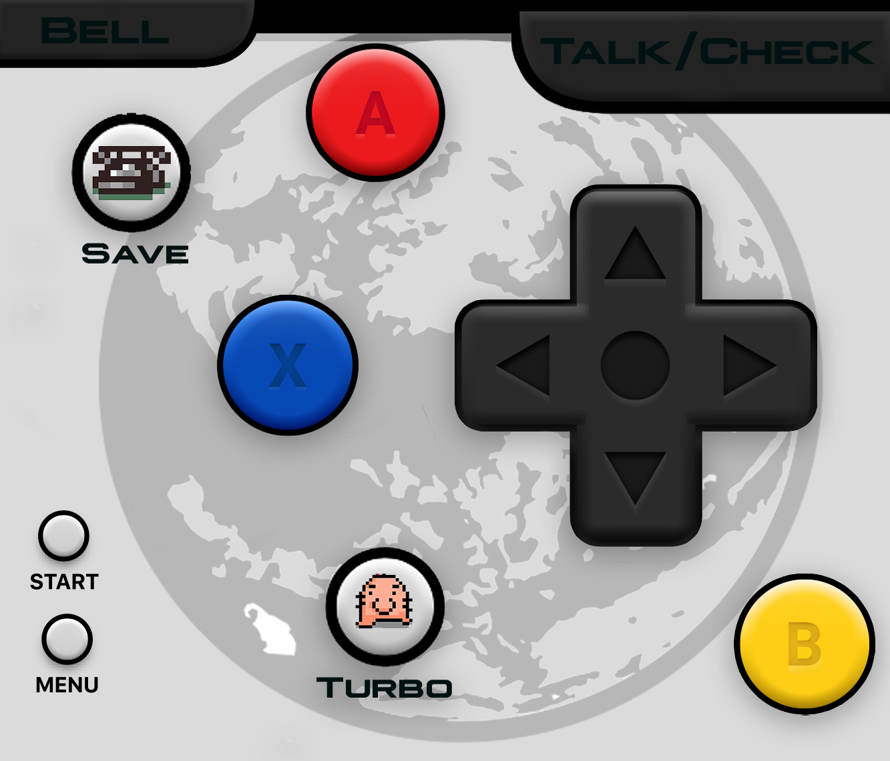

# SNES Earthbound One Hand ( Portrait Only )

Earthbound was designed to be able to play the game on the SNES/SFC controller with just your left hand. The "L" key was a shortcut to "Talk" and "Check" that is in the "A" button menu. The "select" button was mapped to the "B" button. So most of the game could be played with a single hand. 

Learning this, I like to use my phone with a single hand. I'm right handed, so I placed the "D-Pad" on the right side. I aligned the most used buttons fanned out from the "D-Pad" so that one could play EarthBound with just their right hand.

Note: work in progress, so many updates will occur.

This directory contains the `info.json` file required by Delta to map out the overlay of buttons. The `iphone_edgetoedge_portrait.pdf` is generated by the Photoshop File of the same basename.

Please feel free to take the raw files and make your own!

EOL
